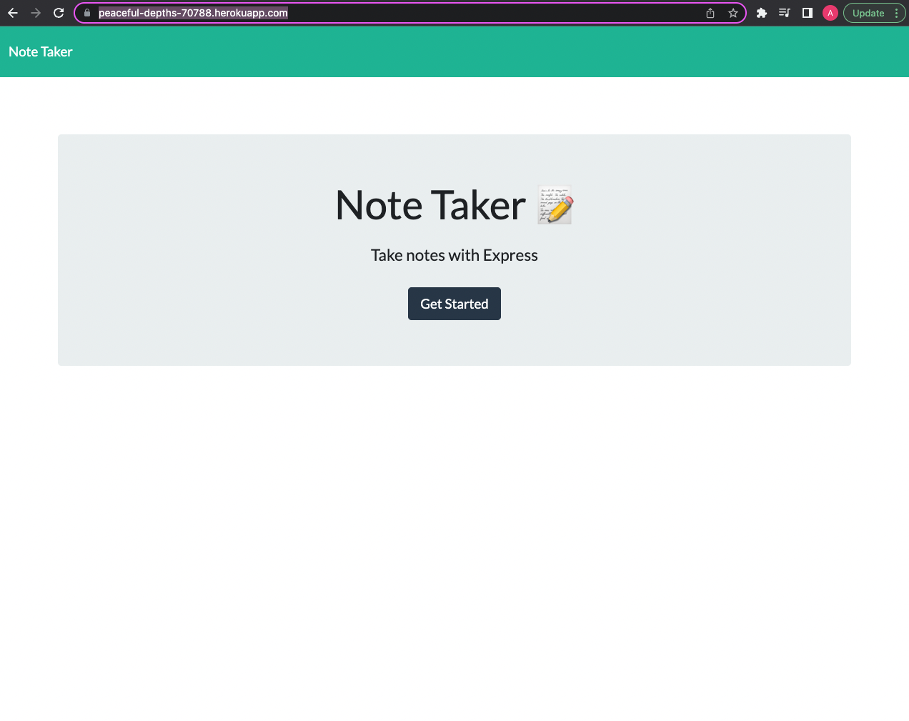
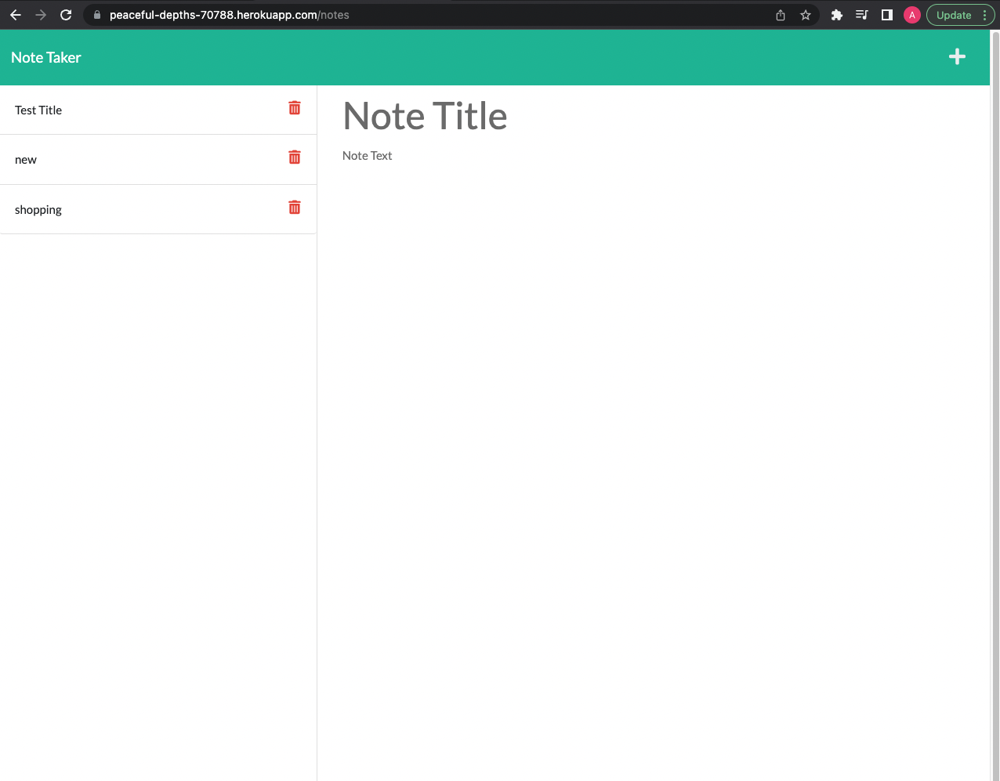

# Note Taker
  ## 
  ## Table of contents
* [description](#description)
* [Installation](#Installation)
* [usage](#Usage)
* [license](#License)
* [Contributing](#Contributing)
* [test](#Test)
* [questions](#Questions)

## Installation
to intall simply click this link: https://peaceful-depths-70788.herokuapp.com/
## Usage

simply click the button to begin and you will be taken to the notes page where you can see all saved notes on the left and in the main section a spot to add a title and text for a new note once there is input in both sections a save icon will apprear in the top right next to the add button .

## License

## Contributing
if you would like to contribute to this project please contact me through the email listed below
## Test
no test available at this time
## Questions
Github: AndrewDippel

If you have any questions feel free to email me @:
a.t.dippel@gmail.com
